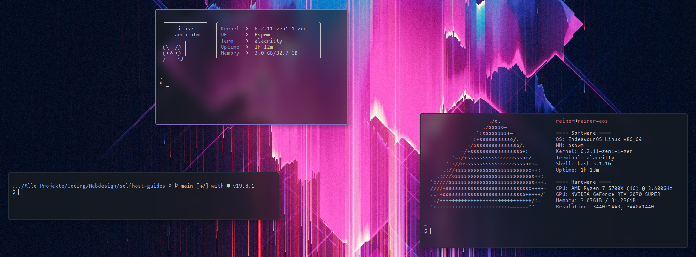
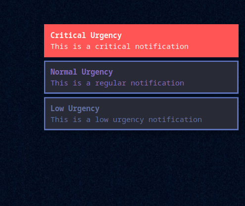

# pretty_dotfiles
the dotfiles for my linux theme. managed by chezmoi, built for arch.

## Screenshots

  
  An empty desktop using PolyBar

  
  The Alacritty terminal with Starship, Macchina and Neofetch

  
  The Alacritty terminal with Starship, Macchina and Neofetch

## Programs used

- WM: Bwpsm
- Keyboard Daemon: sxhkd
- Compositor: picom
- Bar: PolyBar
- Notifications: Dunst
- Menus: Rofi
- Terminal: Alacritty
  - Fetch: Macchina & Neofetch
  - Prompt: Starship

## Setup Information:

I've never tried copy-pasting this config onto another device, so there might be some minor issues, especially inside the Bwpsm config (since it expects to specific display names) and PolyBar (which also expects multiple displays).

Also note that there is no `.bashrc` included in the repo, meaning you need to manually add the call to neofetch/macchina/starship to your local config.
